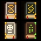

# Pixel Art Diffusion Model

This repository contains an implementation of a diffusion model trained on pixel art images using a U-Net architecture. The model progressively learns to generate pixel art images from noise by reversing a diffusion process.

# Example Outputs





## Features

- Utilizes a **U-Net** architecture for denoising.
- Implements **Denoising Diffusion Probabilistic Models (DDPM)**.
- Custom **image loader** for dataset handling.
- **On-the-fly data augmentation** (resizing, flipping, normalization).
- **Visualization** of diffusion steps.
- **Training pipeline** with loss tracking.
- **Sampling pipeline** to generate new images.

## Dataset

I used the dataset from this website [dataset](https://kyrise.itch.io/) which consists of pixel art images stored in a directory. The images are loaded using a custom dataset class and transformed for training.

### Data Preprocessing

- Resize images to `32x32`, despite images are `32x32` we need to be sure about it.
- Apply random horizontal flipping with a probability of 50%.
- Normalize pixel values to the range `[-1, 1]`.

## Model Architecture

The diffusion model is implemented using **U-Net** with the following configurations:

- **Input Size:** `32x32`
- **Input/Output Channels:** `3` (RGB images)
- **Layers Per Block:** `2`
- **Block Out Channels:** `(64, 128, 256)`
- **Down Blocks:** `("DownBlock2D", "AttnDownBlock2D", "DownBlock2D")`
- **Up Blocks:** `("UpBlock2D", "AttnUpBlock2D", "UpBlock2D")`

## Training

### Training Details

- **Optimizer:** Adam (`lr=1e-4`)
- **Loss Function:** MSE Loss
- **Epochs:** `500`
- **Batch Size:** `16`

### Training Process

1. Images are loaded and transformed.
2. Random noise is added at different timesteps.
3. The model predicts the noise added at a given timestep.
4. The loss is computed between predicted and actual noise.
5. The model parameters are updated through backpropagation.
6. Training continues for `500` epochs.

## Sampling and Image Generation

Once trained, the model is used to generate pixel art images:

1. A **DDPM pipeline** is created using the trained model.
2. Random noise is used as input.
3. The pipeline iteratively removes noise to generate an image.
4. The generated images are saved as `generated_images.png`.

## Visualization

The script includes a function to visualize the diffusion process:

- Clean Image
- Random Noise
- Noisy Image at a given timestep
- Predicted Noise

This helps in understanding how the model denoises images over time.

## Usage

### Training the Model

```bash
python train.py
```

### Generating Images

```bash
python generate.py
```

## Dependencies

- `torch`
- `torchvision`
- `numpy`
- `matplotlib`
- `PIL` (Pillow)
- `tqdm`

Install dependencies using:

```bash
pip install torch torchvision numpy matplotlib pillow tqdm
```

## Results

The trained model generates pixel art images that resemble the training dataset. The quality of generated images improves with more training epochs.

## Future Improvements

- Train on a larger dataset for better diversity.
- Experiment with different noise schedules.
- Optimize the model architecture for better performance.

## ToDos

- Implement using different methods like DDIM, latent diffusion...
- Try different architectures like transformers based
- Add semantic now this just creates what the model has seen in dataset for future work I'll add prompt based generation

## License

This project is open-source and available under the MIT License.

---

### Author

Developed by z3lka.
